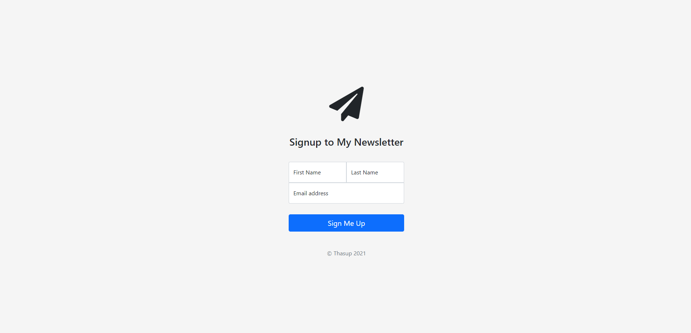

<!-- Add banner here -->

# Newsletter Signup

<!-- Describe your project in brief -->
This is a single newsletter sign up page wrapped with **Bootstrap** framework and powered by **Express** on the back-end which stored your data via **Mailchimp** API.

[Newsletter Signup Link](https://thasup-newsletter.onrender.com/)

# Table of contents

- [Newsletter Signup](#newsletter-signup)
- [Table of contents](#table-of-contents)
- [Features](#features)
- [Install](#install)
- [Languages](#languages)
- [Technology](#technology)

# Features
[(Back to top)](#table-of-contents)

- Elegant and simple sign up page
- Land you on the success/failure page depending on status code
- Post your request to store data at Mailchimp via API

# Install
[(Back to top)](#table-of-contents)

1. clone this git on computer
2. install *node.js*
3. set up `env` file and add mailchimp API key
4. run command `npm install` on terminal
5. run command `nodemon app.js` on terminal
6. go to `http://localhost:3000/`
7. happy!

# Languages
[(Back to top)](#table-of-contents)

- HTML
- CSS
- Javascript

# Technology
[(Back to top)](#table-of-contents)

- HTML
- CSS
- Javascript
- Bootstrap
- API
- Node.js
- Express.js
- Heroku
